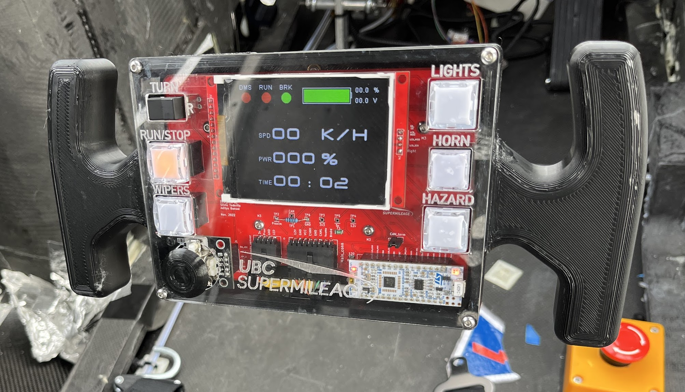
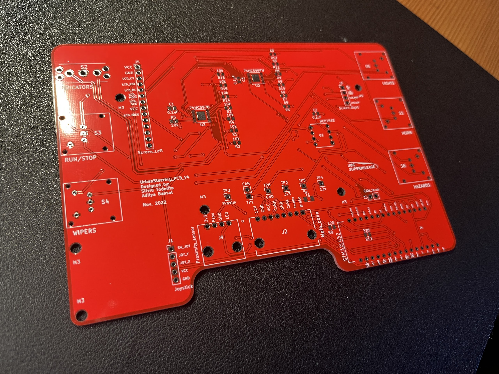

# Urban Steering PCB

The steering wheel for the UBC Supermileage Urban Concept electric vehicle is designed to steer the vehicle, provide information to the driver, and allow the driver to control the vehicle. This repo contains the design files for the printed circuit board at the core of the steering wheel. 

Some features of this PCB:

- STM32L432 Microcontroller with built-in CAN controller
- MCP 2562 CAN Transceiver
- 74HC595 and 74HC597 shift registers for LED output & button input
- ILI9341 3.2" LCD Screen
- Mechanical buttons with dual-color LEDs
- IR proximity sensor for dead man's switch functionality
- SD Card Reader
- Joystick

## Schematic

## Layout 

## Bill of Materials
Found on [Notion](https://www.notion.so/Bill-of-Materials-6644a4c081e64de49a3c111644f56321)

