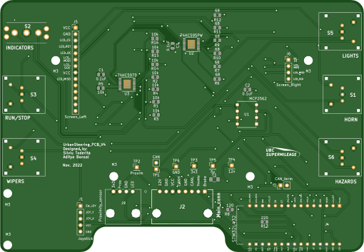

# The Urban Steering PCB ECAD files made within KiCAD

This PCB goes within the steering wheel on Urban to:
* Control vehicle ignition
* Generate and send motor control signals
* Control signals for accessories (lights, wipers, horn, hazards, blinkers)
* Deadman safety switch
* Display critical information to the driver on a LCD screen

Inputs/Outputs
* Main Plug: 12V, CAN H, CAN L, GND
* Brake and Throttle: 3V3, Digital In, Analog In, GND
* Deadman switch: 3V3, Analog In, GND

## Images
Schematic:

Unfilled Layout:

Front Render:

Back Render:

## Bill of Materials
Found within the PCBWay folder for the specific BOM that was used while ordering

## Peak Power Consumption
TODO
